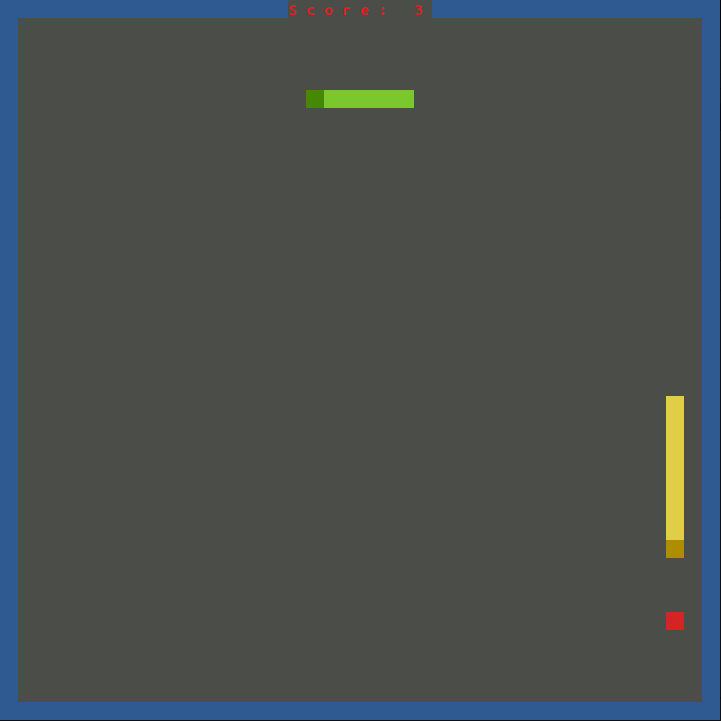

# Snake ...


... on your command line!


[](https://travis-ci.com/baurst/rs_snake) 


This is an implementation of the classic game Snake in Rust.
It runs in all UNIX and Windows terminals without using any GUI framework or window manager.



## Try it out!

### Building from Source
```bash
git clone https://github.com/baurst/rs_snake.git
cd rs_snake
cargo run --release
```
